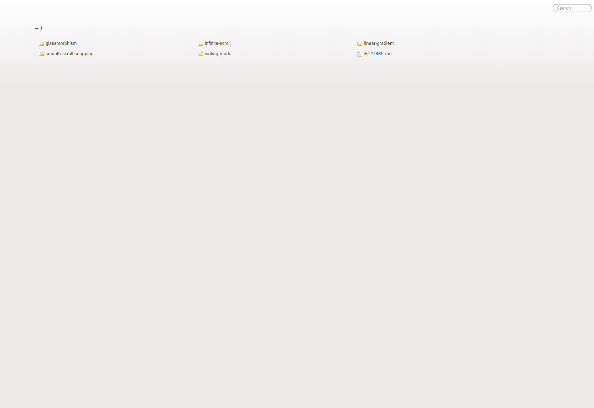
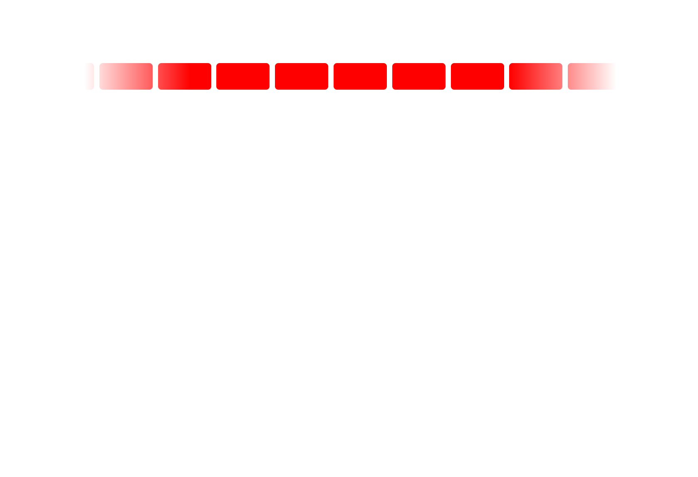
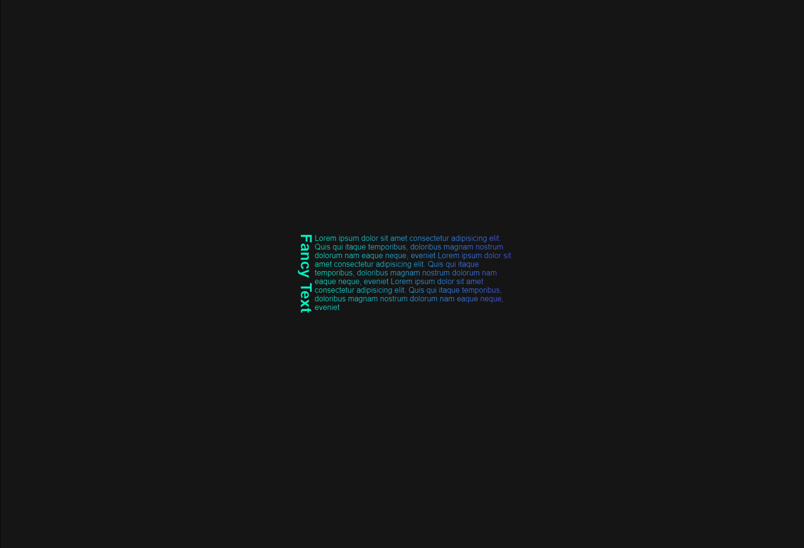
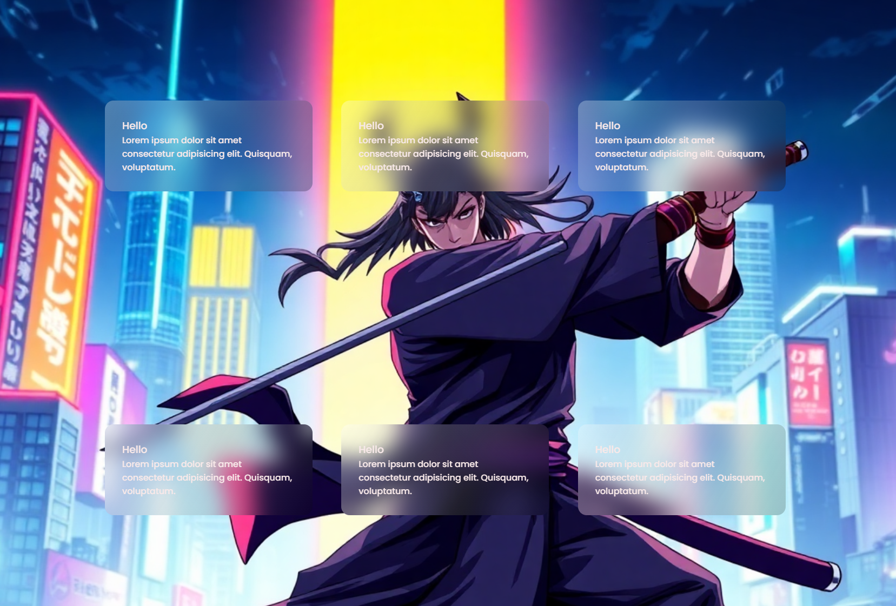

<h1 align="center">Css trainings</h1>

Css trainings for improve different css skills.

To preview you can use 'Live Server' extension in VSCode in root folder and then choose any training folder to view it.

